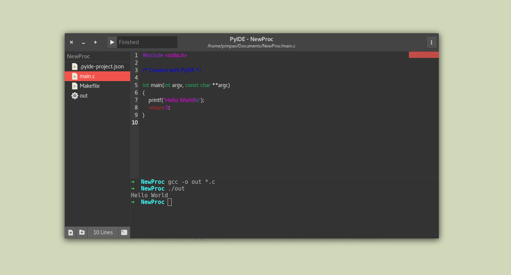

# Py IDE

PyIDE is a basic IDE for Linux written in Python3 + Gtk3. Initially it was inspired on Visual Sutdio for Mac's design.

__Status:__ Almost works as a simple code editor

Right now it looks something like this:



## How to use

As I said on the description, it only supports Linux and Mac, but as I don't have a Mac I'll only provide support for Linux.

These were the only dependencies I had to install on a fresh installed Ubuntu distro:
* libgtksourceview-3.0-dev
* python3-pygit2

Running the IDE:

```bash
  # To run it simply
  python3 main.py

  # You can also provide a path like so
  python3 main.py /path/to/FOLDER
```

\*Quick launcher removed

__As I don't own a set of file icons, you must have a decent icon theme installed and set as default in order to PyIDE work, otherwise it will crash!__

## Features

Sort of works.

* Basic syntax highlighting
* Opening and saving files
* Retarded code completion (based on what you've already typed)
* Crappy "Compile and Run" (you'll see why)
* Basic update on-the-go settings (still doesn't have a settings window, but you can do some stuff with the settings button)
* Integrated terminal
* Dark mode

## To-do

There is a long way ahead with so many features to add, check out some of them.

* Manual syntax highlighting language setting, indentation settings.
* Real time external files/folders creation detection (update and add/remove them to/from the Tree View)
* Tree View support for folders
* Live HTML and Markdown preview (using WebKit-3.0)
* Git operations (such as commit, push, import project from repo, etc)
* Integrated image viewer
* Theming (for syntax highlighting)
* Modules (plugins)
* Search and replace

## Recent Updates

* Searching for Minimap bug workarround
* Bug fixes (on get file languages)
* Started working on a flexible moudules loader
* You can now open files inside folders
* Git icon varies according to darkMode (True/False)

## Known Issues

* ~~Create a project doesn't work~~
* ~~Compile doesn't work for old projects~~
* Create new file and create new folder buttons don't work
* ~~No confirm exit even with unsaved modified files~~
* ~~Can't open files inside folders~~
* Markdown previewer is broken

## FAQ*

\*Actually never asked questions that you might be asking yourself right now

__What theme is that?__

Tha is Numix Gtk.

__For older versions__

That was Arc Flatabulous.