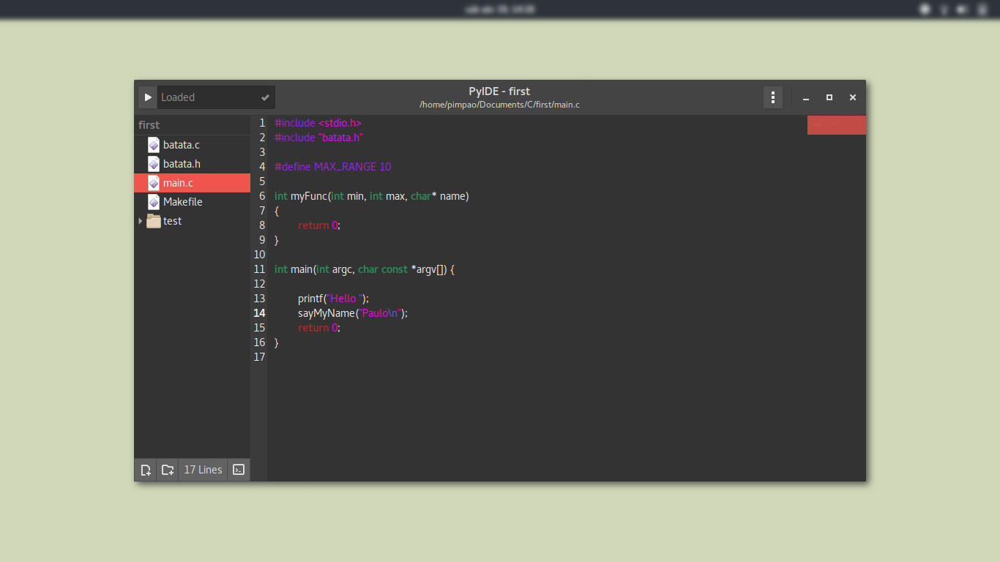

# Py IDE

PyIDE is a basic IDE for Linux written in Python3 + Gtk3. Initially it was inspired on Visual Sutdio for Mac's design.

__Status:__ Works great as a code editor, IDE tools are still being implemented.

__Note for this commit:__ This commit __seems__ to be stable.

Right now it looks something like this:



## How to use

### On Linux

These were the only dependencies I had to install on a fresh installed Ubuntu Gnome distro:
* libwebkitgtk-3.0-dev
* libgtksourceview-3.0-dev
* python3-pygit2
* python3-jedi
* clang

Running the IDE:

```bash
  # To run it simply
  python3 main.py

  # You can also provide a path like so
  python3 main.py /path/to/FOLDER
```

### On Mac

I'm sorry I don't own a Mac, but if you have the necessary packages installed it should be the same process as Linux.

## Features

* Syntax highlighting
* Code completion for Python, and a retarded code completion for other languages
* Compile/Build/Run "system"
* Integrated terminal
* Simple UI customization

## To-do

* Manual syntax highlighting language setting, indentation settings.
* Real time external files/folders creation detection (update and add/remove them to/from the Tree View)
* Live HTML and Markdown preview (using WebKit-3.0)
* Git operations (such as commit, push, import project from repo, etc)
* Integrated image viewer
* Theming (for syntax highlighting)
* Modules (plugins)
* Search and replace

## Recent Updates

New:
* Fixed linter keeping process awake

Old:

* Linter module added
* Working on linting for C/C++

## Known Issues

* Markdown previewer is broken
* ~~Linter sometimes keeps the process on after PyIDE is closed~~

## Notes

Thmes that you might see on the preview picture: Adwaita, Numix and Arc Flatabulous.

Python code completion was created by [isamert](https://github.com/isamert) check out the original code [here](https://github.com/isamert/gedi).
