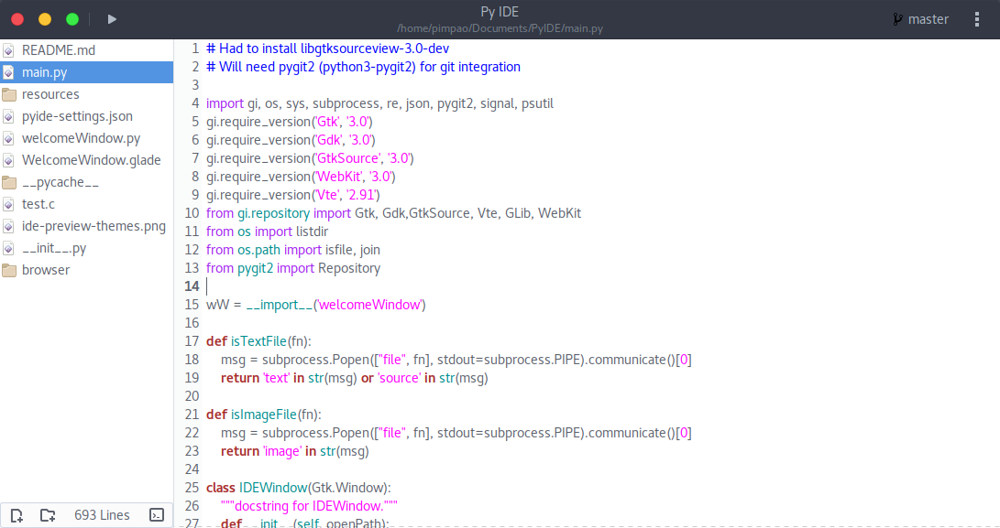

# Py IDE

Py IDE is a basic IDE for Linux and Mac (if you use Windows, don't) written in Python3 and using GTK3 libraries as GUI. It is inspired on Visual Studio for Mac (not VS Code) - released on November 16th 2016.

__Status:__ Barely works as a code editor :(

Right now it looks something like this:



## How to use

As I said on the description, it only supports Linux and Mac, but as I don't have a Mac I'll only provide support for Linux.

These were the only dependencies I had to install on a fresh installed Ubuntu distro:
* libgtksourceview-3.0-dev
* python3-pygit2

Running the IDE:

```bash
  # To run it simply
  python3 main.py

  # You can also provide a path like so
  python3 main.py /path/to/FOLDER
```

\*Quick launcher removed

## Features

Sort of works.

* Basic syntax highlighting
* Opening and saving files
* Retarded code completion (based on what you've already typed)
* Crappy "Compile and Run" (you'll see why)
* Basic update on-the-go settings (still doesn't have a settings window, but you can do some stuff with the settings button)

## To-do

A lot. Check out what is being developed right now:

* Menu button featuring settings menu, new file and folder creation, manual syntax highlighting language setting, and more.
* Real time external files/folders creation detection (update and add them to the Tree View)
* Tree View support for folders
* Improve dark theme
* Live HTML and CSS preview (using WebKit2-4.0)
* Full git integration
* Native image support
* Markdown preview

## Recent Updates

* Started working on Markdown preview
* Layout changes
* Settings button

## Known Issues

* Create a project is broken (totally)
* Buttons bellow Tree View don't work (I haven't created a function for them yet)
* Doesn't alert you if you close the editor without saving a file
* Tree View doesn't do anything with folders yet

## FAQ*

\*Actually never asked questions that you might be asking yourself right now

__What theme is that?__

That is Arc Flatabulous, best theme ever (yes it has a dark version).
